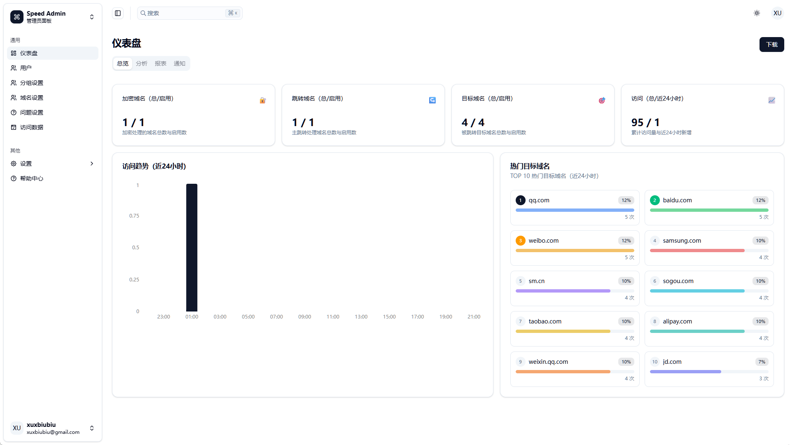
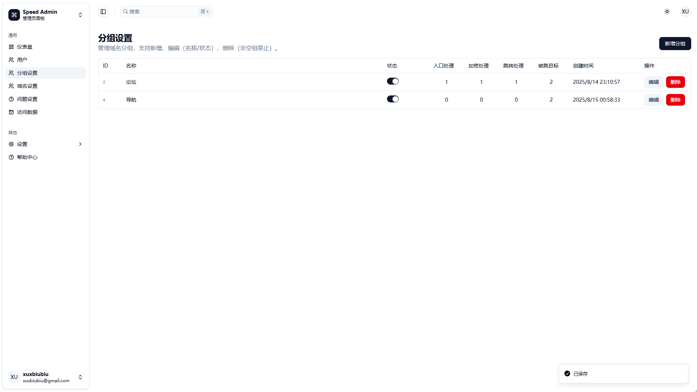
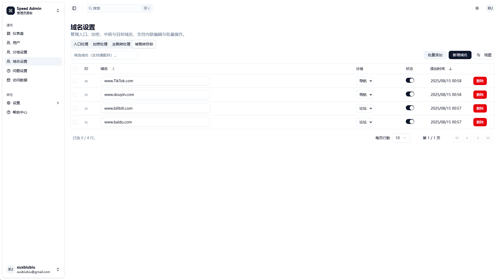
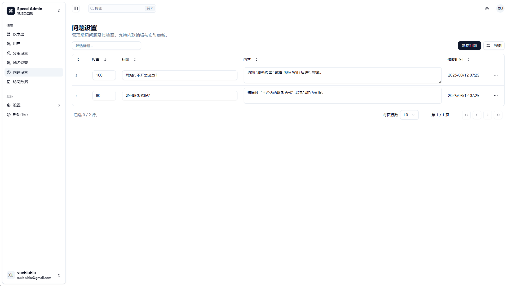
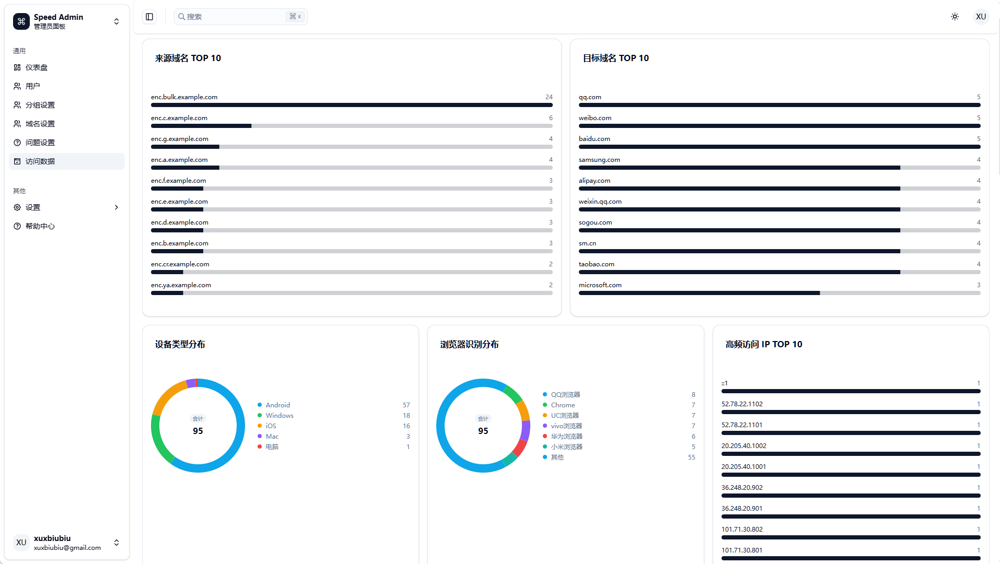
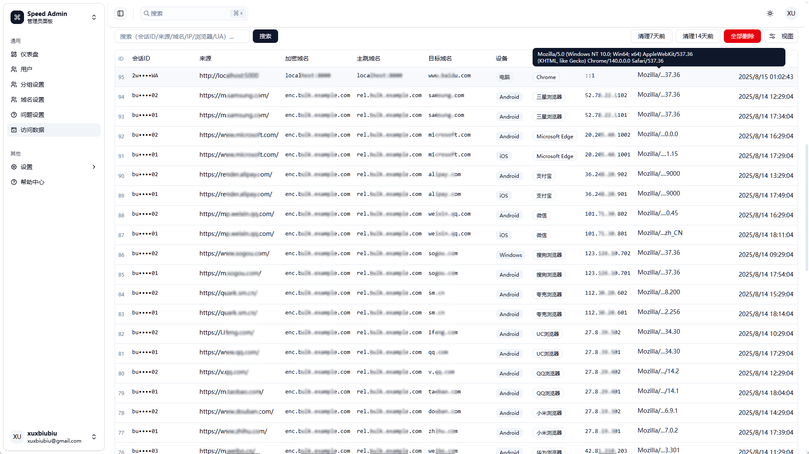
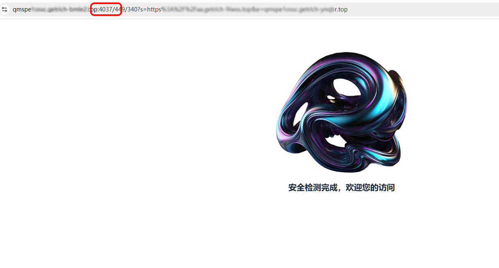
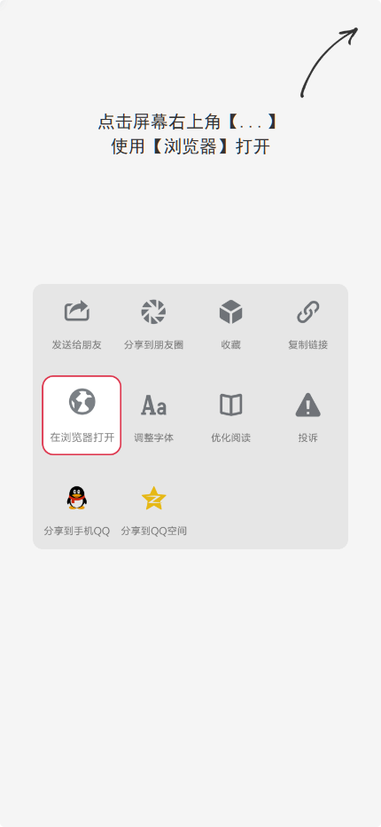
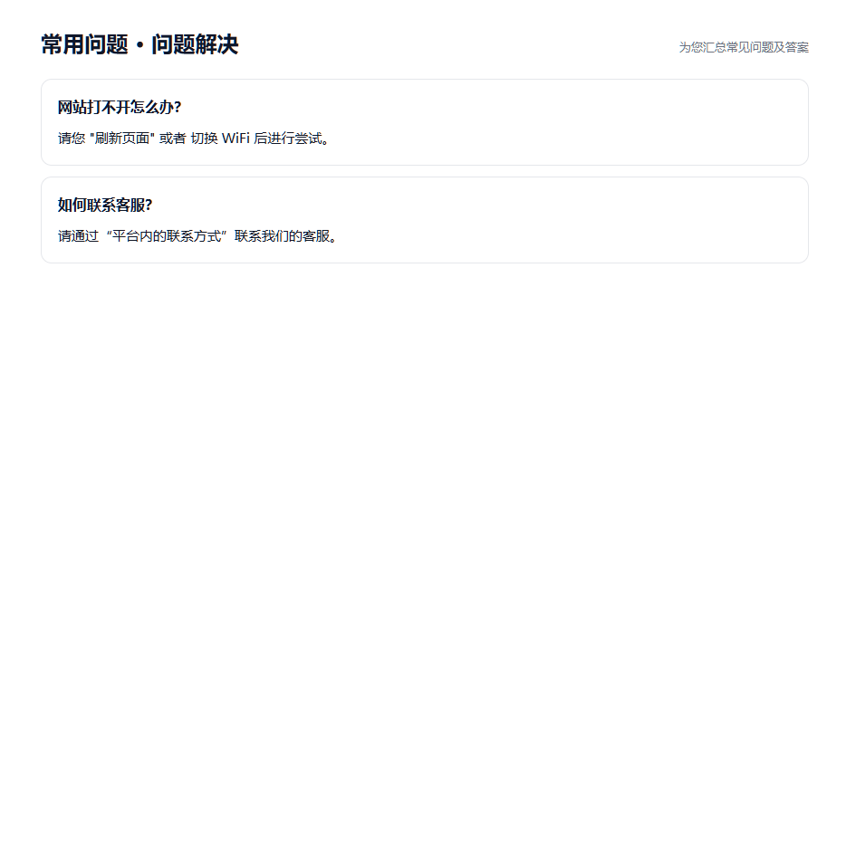

# Bypassing-The-Block
防屏蔽中转跳转系统 - 防墙/防爬虫/防红系统

防屏蔽中转跳转系统 - AI 级识别·过滤·导航转发  
让流量稳定抵达目标页，降低拦截与误封风险，企业级安全导航与流量管理解决方案

关键词："防屏蔽, 中转跳转, 防火墙绕过, 反爬虫, 防红, 域名加密, 跳转系统, AI识别, 智能过滤, 导航转发, 反屏蔽, 网址保护, 防运营商检测, 高并发跳转系统, 防审计, 导航站, 防屏蔽导航, 多域名跳转系统, 企业级安全, 流量管理, 防QQ拦截, 防微信拦截, 微信防红, QQ防红, ,端口跳跃, 泛解析, 请求日志, 可视化分析, 跳转策略, 分组转发, 安全导航, 动态混淆, 高并发, 轻量WAF, 防入侵, 防监听, 防运营商检测, 自动化防护, 多域名轮换, 误封防护, 业务系统兼容, React系统, Go语言开发, 异步日志, 低资源占用, 安全过滤, 运营面板, 支付集成, 多重防护, 多场景适用, 防抓取, 反检测, 站点防护, React防屏蔽前端, 网站安全, 反监听跳转, 反屏蔽智能系统, 企业流量安全, 智能导航"

---

## 支持如下功能：

### 【分组内进行转发】
- 多个分组相互独立、互不影响
- 单分组内可灵活配置跳转策略

### 【域名加密混淆】
- 防自动化程序与各类爬虫抓取
- 降低 QQ/WX拦截与“红标”风险
- 动态端口跳跃
- 动态泛解析轮换

### 【可视化日志】
- 支持对每个请求进行详细分析与检索

### 【问题设置】
- 在跳转处显示自定义常见问题解答（如图示例）

### 【高性能高并发】
- 兼容各类业务系统、运营面板与服务器环境，易集成支付与现有流程
- 基于 React + Go 语言开发，模块化设计、异步日志，性能稳定
- 资源占用小：1 核 CPU / 1GB 内存服务器可轻松部署与使用 部署内存占用仅为 50MB

### 【安全性】
- 采用成熟技术栈并配套多重安全过滤，提升运营安全性
- 内置轻量 WAF，可防入侵、防爬虫与异常访问

### 【防侦测与反屏蔽智能系统】
- 防止防火墙抓取侦测
- 防监听
- 防运营商检测
- 防墙
- 防屏蔽智能系统

### 【使用场景】
- 多域名站点易被误封或受到爬虫干扰
- 需要灵活管控多分组多域名的转发策略，减少频繁换域名、降低对导航站依赖

### 【售后保障】
- 提供 1 年问题处理与部署支持
- 持续更新，第一时间适配最新防护策略
- 专属优化建议与快速响应服务

## 相关联系
 - [Telegram: https://t.me/U_BiuBiu](https://t.me/U_BiuBiu)